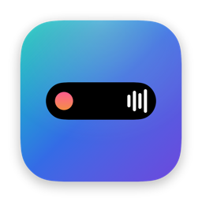

<div align="center">



# Notchless

**Turn your Mac's notch into a Dynamic Island.**

A native macOS menu-bar app that puts live activities, HUDs, and on-device dictation into the notch — with an iOS-style, physics-driven feel.

</div>

---

## Features

### Live Activities (the notch reacts to what's happening)
- **Now Playing** — album art, a real audio-reactive visualizer (system-audio FFT), scrubber, and transport controls. The bars pick up the album-art glow.
- **Auto carousel** — when several things are live at once (music + a call, etc.), swipe horizontally to page between them; browse Calendar and System Stats too.
- **Battery hub** — charge, charging state, time remaining, with a charge ring.
- **System Stats** — live CPU / memory / network, with a refresh interval and per-metric toggles.
- **Claude Usage** — parses local Claude Code transcripts for token usage: a pie of the input/output/cache split, a daily line chart, and 5-hour session / weekly / daily estimated spend.
- **Timer** — a countdown with presets and a ring, controllable from the notch.
- **Clipboard history** — recent copies, click to re-copy, plus a screen colour picker.
- **Privacy indicator** — a pulsing dot when the camera/mic is in use (green/orange), like macOS's own.
- **Calendar** — upcoming events and weather.
- **File Tray** — drag files onto the notch to hold them, drag them back out anywhere.
- **Todos** — a notch checklist with subtasks and free-text (URL-aware) notes; edits stay in sync between the notch and Settings.
- **Goals** — savings goals with a target and deadline, logged contributions, a required monthly-pace calculation, and a progress ring; pin one to the notch.

### Dictation (ported from a standalone app, fully integrated)
- Hold-to-talk anywhere; types into the focused app.
- Two on-device engines: **Apple Speech** and **Parakeet** (NVIDIA Parakeet TDT on the Neural Engine via FluidAudio).
- Optional AI cleanup — local `claude` CLI, the Anthropic API, or **on-device Gemma** (llama.cpp).
- Custom vocabulary, snippets/text-expansion, spoken operators, per-app tone learning, encrypted history, and more.

### HUDs & notifications
- Notch-anchored **volume** and **brightness** HUDs replacing the system OSD.
- Polished transient banners for charging, Bluetooth, Focus, and network (No Internet / Back online).

### System & polish
- **Follows your active display** across the built-in screen and external monitors.
- **Stays visible over fullscreen** apps (optional).
- **Liquid Glass** theming (Clear / Tinted + intensity) on macOS 26; the primary accent follows your macOS accent colour.
- iCloud-synced settings, launch-at-login, hide-from-screen-capture, and per-feature toggles.
- Two-finger swipe gestures over the notch.

## Requirements

- macOS 14.0+ (Liquid Glass effects and Parakeet require newer macOS / Apple Silicon)
- Xcode 16+
- [XcodeGen](https://github.com/yonaskolb/XcodeGen) (`brew install xcodegen`)

## Build

```bash
brew install xcodegen
xcodegen generate
xcodebuild -project Notchless.xcodeproj -scheme Notchless \
  -configuration Debug -destination 'platform=macOS' \
  -skipMacroValidation build
```

`-skipMacroValidation` is required because the on-device Gemma path depends on
[LLM.swift](https://github.com/eastriverlee/LLM.swift), which uses a Swift macro
that Xcode blocks in non-interactive builds.

The project is generated from `project.yml` — the `.xcodeproj` is not committed.

## Permissions

Grant these in **System Settings → Privacy & Security** (the in-app **Permissions**
pane lists them with live status):

- **Accessibility** — hold-to-talk hotkey and pasting dictated text
- **Microphone** / **Speech Recognition** — dictation
- **Camera** — the notch camera mirror
- **Audio Recording** — the live system-audio music visualizer
- **Calendar**, **Bluetooth**, **Location** — the respective live activities

## Tech

SwiftUI + AppKit, a borderless non-activating `NSPanel` over the notch, XcodeGen
for the project, and Combine for state. Speech via `AVAudioEngine` + `vDSP` FFT.
Dependencies: [FluidAudio](https://github.com/FluidInference/FluidAudio) (Parakeet,
Apache-2.0), [LLM.swift](https://github.com/eastriverlee/LLM.swift) (Gemma, MIT),
and [mediaremote-adapter](https://github.com/ungive/mediaremote-adapter) (now-playing, BSD-3).

## Acknowledgements

Inspired by the great work of the macOS notch community — Alcove, boring.notch,
Atoll, DynamicNotch, rtaudio, and SkyLightWindow. All designs and code here are
original reimplementations; no GPL code or assets from those projects were used.

## License

Copyright © HOMEKARE TECHNOLOGY LTD. All rights reserved.
